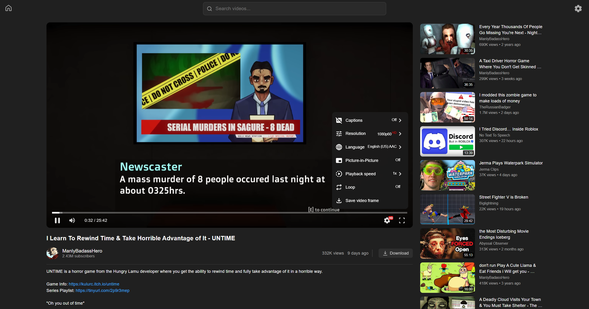
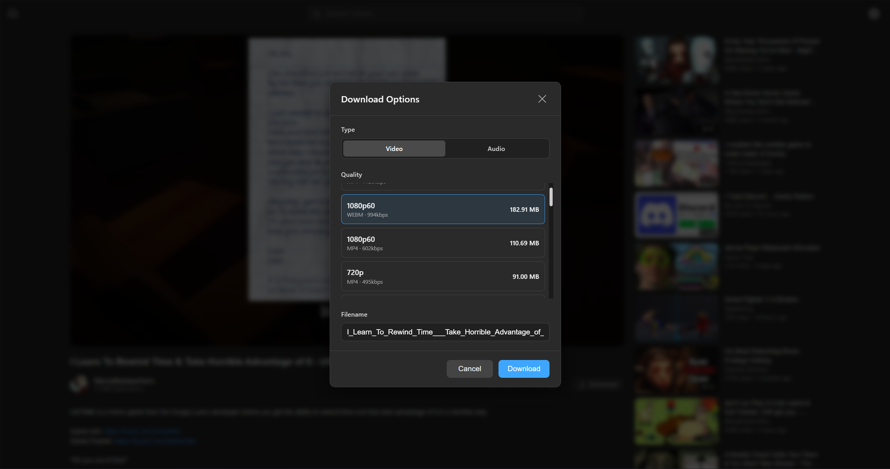

# Kira

Initially, this project was created to showcase how [Shaka Player][shaka] can be adapted to play videos streamed via YouTube’s SABR protocol. It now serves as a general example for the [YouTube.js][youtubeijs] and [googlevideo][googlevideo] libraries.

## Screenshots

| [](screenshots/home-page.png) | [](screenshots/watch-page.png) | [](screenshots/downloader.png) |
| ---------------------------------------------------------------- | -------------------------------------------------------------------- | ------------------------------------------------------------------------ |

## Features

* Play videos using SABR streaming.
* Nearly instant playback load times.
* Support for Live, Post-Live, and VOD content (Live content still uses standard HLS/DASH manifests).
* Recommendation system using persistent InnerTube sessions.
* Responsive on both desktop and mobile browsers (NOTE: Most mobile browsers do not support extensions; you'll need a proxy).
* SABR-based downloader.
* Video search.

## Building from Source

1. Install dependencies and run the application:
```bash
npm install
npm run dev

# To build for production:
npm run build
```

2. Open your browser and navigate to `http://localhost:5173` and follow the instructions on the page.

## Technical Stuff

About a year or two ago, YouTube started experimenting with SABR (Server-side Adaptive Bitrate) streaming. It allows the server to dynamically adjust the stream based on the user's network conditions and device capabilities. While this is good for YouTube, implementing SABR properly in third-party apps (for example [FreeTube][freetube], [NewPipe][newpipe], [GrayJay][grayjay]) is quite difficult.

Unlike standard DASH or HLS streams, SABR streams use a custom response format (UMP) that is incompatible with existing video players. And on top of that, SABR delivers both audio and video segments in a single request, rather than separately, and uses player time in combination with buffered range metadata instead of byte ranges when requesting specific segments.

Trying to get around the aforementioned issues, I implemented a few layers of abstraction to make things easier to work with. You can find the actual code for these modules in the [luanrt/googlevideo][googlevideo] repository, but here's a small overview for each one:

* [`SabrStreamingAdapter`][sabrstreamingadapter] - A bridge between the SABR protocol and media players. It manages the streaming session, creates request payloads, and handles server signals. Players must implement the [`SabrPlayerAdapter`][sabrplayeradapter] interface to use it.
* [`SabrUmpProcessor`][sabrumpprocessor] - A UMP processor that extracts audio/video segments and metadata from the UMP response, allowing the underlying player to consume them as standard segments.

Other important modules used internally:
* [`CompositeBuffer`][compositebuffer] - A buffer that manages discontinuous chunks as a single logical stream.
* [`UmpReader`][umpreader] - A parser that efficiently processes chunked UMP binary data.

This project's implementation of the `SabrPlayerAdapter` interface for Shaka Player can be found in [`src/streaming/ShakaPlayerAdapter.ts`][shakaplayeradapter].

### How it works
The core of the integration is the [`SabrStreamingAdapter`][sabrstreamingadapter], which is initialized with our custom [`ShakaPlayerAdapter`][shakaplayeradapter] class.

Instead of a standard manifest URL, Shaka Player is loaded with a dynamically generated DASH manifest for VOD content or a standard HLS/DASH manifest for live and post-live streams. The [`ShakaPlayerAdapter`][shakaplayeradapter] registers a custom networking scheme to intercept all segment requests.

When Shaka Player requests a media segment, the request is modified and a proper payload is created. The response for these requests has a `content-type` of `application/vnd.yt-ump`; if that content type is present, the response is streamed through a [`SabrUmpProcessor`][sabrumpprocessor].

The processor extracts the specific media data Shaka requested, along with metadata needed to maintain the streaming session, and then aborts the request to save bandwidth.


## Acknowledgments
Special thanks to [@absidue](https://github.com/absidue) for helping debug Shaka Player issues and investigating different implementation approaches.

## License
Distributed under the [MIT](./LICENSE) License.

<p align="right">
(<a href="#top">back to top</a>)
</p>

<!-- Reference links to keep this from getting too messy. -->
[shaka]: https://shaka-player-demo.appspot.com/
[screenshot]: https://github.com/user-attachments/assets/a415b993-aeef-4dea-83ae-1ee2fb7efdb2
[node]: https://nodejs.org/
[deno]: https://deno.com/
[freetube]: https://freetubeapp.io/
[newpipe]: https://newpipe.net/
[grayjay]: https://grayjay.app/
[googlevideo]: https://www.github.com/LuanRT/googlevideo
[youtubeijs]: https://github.com/LuanRT/youtube.js
[sabrstreamingadapter]: https://github.com/LuanRT/googlevideo/blob/main/src/core/SabrStreamingAdapter.ts
[sabrplayeradapter]: https://github.com/LuanRT/googlevideo/blob/main/src/types/sabrStreamingAdapterTypes.ts#L81-L93
[sabrumpprocessor]: https://github.com/LuanRT/googlevideo/blob/main/src/core/SabrUmpProcessor.ts
[compositebuffer]: https://github.com/LuanRT/googlevideo/blob/main/src/core/CompositeBuffer.ts
[umpreader]: https://github.com/LuanRT/googlevideo/blob/main/src/core/UmpReader.ts
[shakaplayeradapter]: src/streaming/ShakaPlayerAdapter.ts